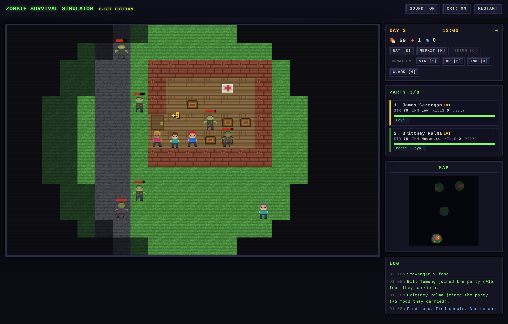
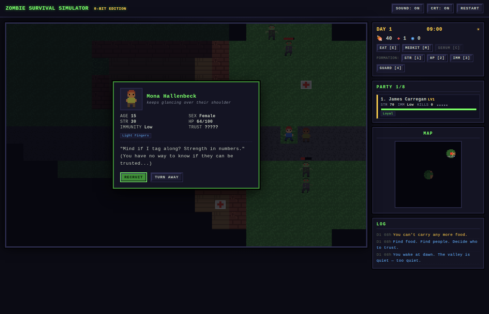

# Zombie Survival Simulator — 8-Bit Edition

A full pixel-art remake of the original zombie survival simulator. Same soul — scavenge, recruit,
judge who to trust, survive as long as you can — rebuilt as a proper 8-bit roguelike with a
procedurally generated world, fog of war, a day/night cycle, personality traits, and chiptune
sound effects. No frameworks, no build step, no dependencies: pure HTML5 canvas + vanilla JS.

## Play

Open `index.html` in any modern browser — desktop or mobile. That's it.

Pick a difficulty on the title screen, then hit START. Best runs are tracked per difficulty.

| Difficulty | Horde size | Serums on the map | James's immunity |
| --- | --- | --- | --- |
| Easy | ¼ | 8 | Immune — he can never turn |
| Normal | ½ | 6 | Low |
| Hard | full | 4 | None |

You are **James Carregan**. The world moves only when you do — every step is one in-game hour.
Survive as many days as you can. When the last member of your party falls, your story ends.

On touch devices an on-screen D-pad appears over the map: tap to step (hold to keep walking),
and tap the center ✦ button to wait an hour.

## Controls

| Key | Action |
| --- | --- |
| Arrow keys / WASD | Move (bump a zombie or hostile to attack; bump a stranger to talk) |
| Space | Wait one hour |
| E | Eat — feed the wounded (1 food = 20 HP) |
| M | Use a medkit on the most wounded member (+40 HP) |
| C | Use a serum to cure an infected member |
| 1 / 2 / 3 / 4 | Formation: strongest / healthiest / most immune first, or shield the weakest |
| Enter | Start / restart |

Whoever stands **first in the formation** takes and deals the blows in every fight — sorting your
party well is the difference between a scratch and a funeral.

## The world

- A procedurally generated valley: roads, scavengeable buildings, farms, forests, and lakes.
- **Fog of war** — you only know what you've seen, and only trust what you can see right now.
- **Day/night cycle** — at night your sight shrinks and the dead get bold: they spawn faster and
  chase from farther away.
- **Loot**: food crates (keep the party fed and heal wounds), medkits, and rare **serum** vials —
  the only cure for infection, found *only inside buildings*. Buildings hold the best loot, and
  sometimes worse things.

## The people

Every survivor rolls **strength, health, immunity, trust (0–5)** and one or two **personality
traits** — and trust is *hidden* unless someone in your party is a Judge of Character. Recruiting
is a gamble: a stranger is a pair of hands, or a knife in the dark.

| Trait | Effect |
| --- | --- |
| Brawler | +30% damage, but may provoke strangers into fights |
| Medic | Patches the whole party +3 HP every dawn |
| Scout | +2 sight radius |
| Coward | 35% chance to flinch and skip their attack |
| Glutton | Eats double rations |
| Iron Gut | Only needs a ration every other day |
| Charmer | Hostile strangers may back down instead of attacking |
| Judge of Character | Reveals the true trust level of strangers |
| Night Owl | The party keeps full sight radius at night |
| Light Fingers | +50% scavenged food… but low-trust thieves rob you in the night |
| Loyal | Will never steal from you or desert |
| Tough | +20 max HP |

Low-trust survivors attack on sight or shake you down for food. Recruit an unknown and they might
steal your supplies at 3 a.m. and vanish. More mouths need more food — but more hands kill more
zombies.

## The dead

- Kills earn **experience**: members level up, gaining strength and max HP.
- Zombie bites can **infect** — an infected member turns in 48 hours, *inside your camp*, unless
  you find a serum or leave them behind. Immunity matters: an Immune member can never turn.
- Anyone who dies **rises**. Party members, strangers, the person you turned away yesterday.

## Under the hood

~2,000 lines of dependency-free vanilla JavaScript:

| File | Role |
| --- | --- |
| `js/data.js` | Constants, palette, sprite pixel-maps, traits, names, RNG |
| `js/world.js` | Procedural map generation |
| `js/entities.js` | Survivors, zombies, combat math |
| `js/render.js` | Pixel-art renderer: tile atlas, sprite baking, fog, minimap, 3×5 pixel font |
| `js/audio.js` | WebAudio chiptune SFX (no audio files) |
| `js/ui.js` | HUD, roster, log, dialogs |
| `js/main.js` | Game state, simulation, input |

All art is generated at runtime from pixel-maps and drawn to a 336×208 buffer upscaled with
nearest-neighbor filtering; sounds are synthesized oscillators. CRT scanlines are one CSS gradient
— toggle them (and the sound) in the top bar.

*In memory of the original circles: red (you), blue (them), grey (it's too late).*
